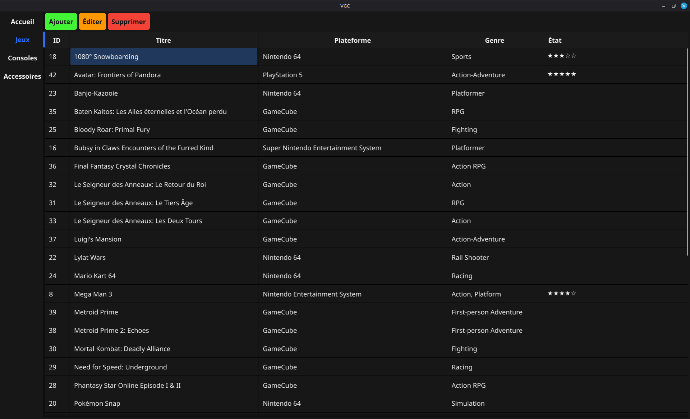

# VGC - Video Game Collector
I was tired of using Excel to manage my video games collection so I made an app for it.

## Can anyone use it?
Kind of. I'm writing this app for my own usage, therefore the queries correspond to how my DB is structured but if you're brave enough, you can adapt the code to your own project.

## Why isn't the repo private then?
Laziness.

## Why is the interface in French?
I live in a French speaking area and most of my collection has either French or European editions of games and consoles. I therefore chose to make the UI in French. However, the code is commented in english and most variables and functions are in English as well.